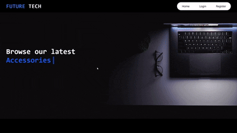

# 🛒 TECH-STORE ( MERN E-Commerce App )

A full-stack shopping cart application built with the MERN stack (MongoDB, Express, React, Node.js). This project features user authentication, product browsing, cart management, and secure token handling—all wrapped in a responsive, animated UI.

---
## 🚀 Demo


## 📦 Tech Stack

| Layer       | Technology                          |
|-------------|--------------------------------------|
| Frontend    | React, Tailwind CSS, Framer Motion   |
| Backend     | Express.js, Node.js                  |
| Database    | MongoDB, Mongoose                    |
| Auth        | JWT (Access & Refresh Tokens)        |
| UI Routing  | React Router                         |
| API Client  | Axios                                |

---


## 🚀 Features

### 🧑‍💻 Frontend

- Dynamic product listing with hover animations
- Add/remove items from cart with live quantity updates
- Cart badge showing total items
- Authenticated user session via localStorage
- Logout flow with redirect
- Responsive design using Tailwind CSS
- Framer Motion for smooth UI transitions

### 🔐 Backend

- User registration and login with password hashing
- JWT-based access and refresh token system
- Secure cookie handling (`httpOnly`, `sameSite`, `secure`)
- Cart retrieval and update endpoints
- Token refresh and logout logic
- Seed route for product initialization
- Test user creation route for development

---

## 📁 Folder Structure

```
├── client/                 # React frontend
│   ├── src/
│   │   ├── components/
│   │   ├── pages/
│   │   ├── api/axiosInstance.js
│   │   └── App.jsx
│
├── server/                 # Express backend
│   ├── models/
│   │   ├── user.model.js
│   │   └── product.model.js
│   ├── routes/
│   │   ├── auth.routes.js
│   │   └── product.routes.js
│   ├── utils/
│   │   ├── token.js
│   │   └── asyncHandler.js
│   └── middleware/
│       └── auth.middleware.js
```

---

## 🔧 Setup Instructions

### 1. Clone the repo

```bash
git clone https://github.com/your-username/mern-cart-app
cd mern-cart-app
```

### 2. Install dependencies

```bash
# Backend
cd server
npm install

# Frontend
cd ../client
npm install
```

### 3. Environment Variables

Create a `.env` file in the `server` directory:

```env
PORT=5000
MONGO_URI=your_mongodb_connection_string
JWT_ACCESS_SECRET=your_access_secret
JWT_REFRESH_SECRET=your_refresh_secret
```

### 4. Run the app

```bash
# Backend
npm run dev

# Frontend
npm run dev
```

---

## 📌 API Endpoints

### Auth Routes

| Method | Endpoint         | Description               |
|--------|------------------|---------------------------|
| POST   | `/register`      | Register new user         |
| POST   | `/login`         | Login and get tokens      |
| POST   | `/logout`        | Clear cookies and logout  |
| POST   | `/refresh`       | Refresh access token      |

### Cart Routes

| Method | Endpoint         | Description               |
|--------|------------------|---------------------------|
| GET    | `/cart`          | Get user's cart           |
| POST   | `/cart/update`   | Update cart items         |

### Product Routes

| Method | Endpoint             | Description                     |
|--------|----------------------|---------------------------------|
| GET    | `/seed-products`     | Seed initial product data       |
| GET    | `/`                  | Fetch all products              |


---


